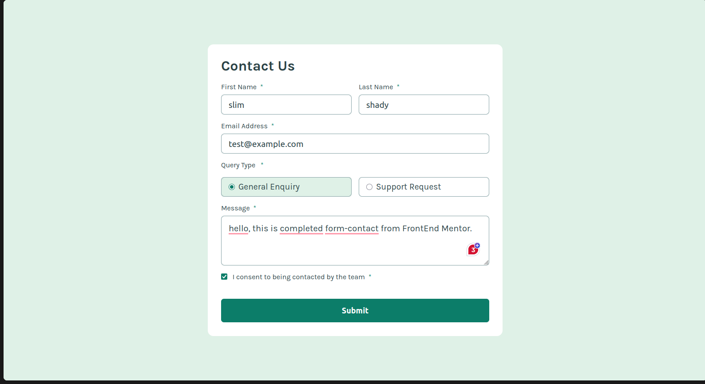
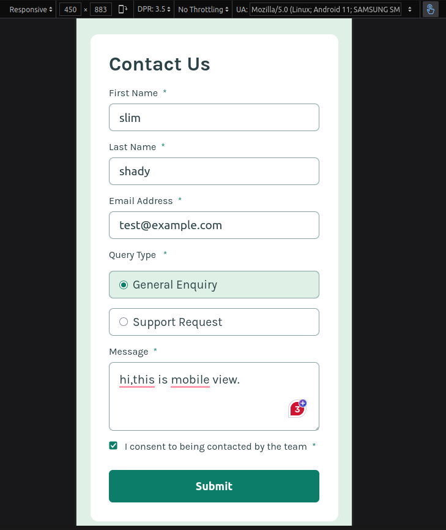
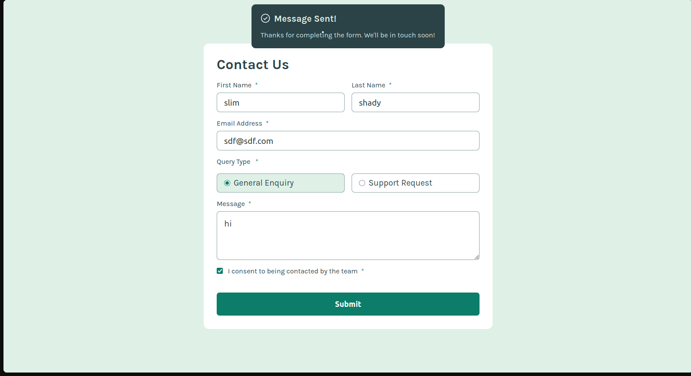

# Frontend Mentor - Contact form solution

This is a solution to the [Contact form challenge on Frontend Mentor](https://www.frontendmentor.io/challenges/contact-form--G-hYlqKJj).

## Table of contents

- [Overview](#overview)
  - [The challenge](#the-challenge)
  - [Screenshot](#screenshot)
  - [Links](#links)
- [My process](#my-process)
  - [Built with](#built-with)
  - [What I learned](#what-i-learned)


## Overview

### The challenge

Users should be able to:

- Complete the form and see a success toast message.
- Receive form validation messages if:
  - A required field has been missed
  - The email address is not formatted correctly
- Complete the form only using their keyboard.
- Have inputs, error messages, and the success message announced on their **screen reader**
- View the optimal layout for the interface depending on their device's screen size
- See hover and focus states for all interactive elements on the page

### Screenshot






### Links

- Solution URL: [Add solution URL here](https://www.frontendmentor.io/solutions/html-css-s2bs4wfHML)
- Live Site URL: [Contact Form](https://daniyal-abbassi.github.io/Frontend-Mentor-Contact-Form/)

## My process

### Built with

- Semantic **HTML5** markup
- **CSS** custom properties
- Flexbox


### What I learned 

I learned and re-use some cool CSS properties: 
``@font-face``, ``accent-color``, ``:has()``, ``:user-invalid``

```css
/*When you want to use local font */
@font-face {
  font-family: 'customName';
  src: url('./example') format('type');
}
/*for changing radio and checkbox colors */
input {
  accent-color: #000000 
}
/* When you wanna change an element's style **if** some condition is met.
like when an input is checked */
.element:has(input:checked) {
  background-color: red;
}
/*if an input is invalid or empty */
input:user-invalid {
  border: red;
}
```

